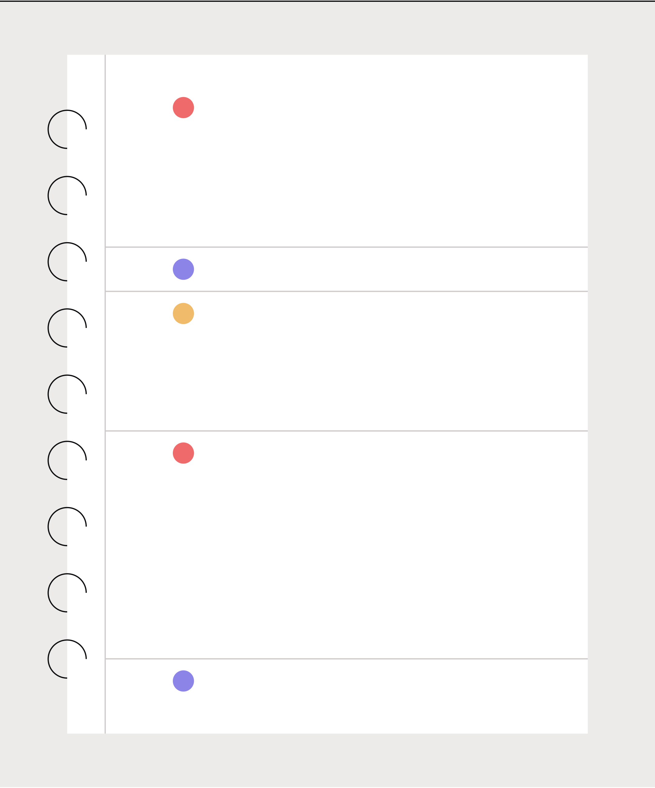

{width="0.9027777777777778in"
height="0.19444444444444445in"}

> Software requirement specification (SRS) document template
>
> Project name:
>
> Date:
>
> Version:
>
> By:

+-----------------------------------------------------------------------+
| +------------------------------------------------------------------+  |
| | > Revision history                                               |  |
| +==================================================================+  |
| +------------------------------------------------------------------+  |
+=======================================================================+
+-----------------------------------------------------------------------+

+-----------------------------------------------------------------------+
| +---------------+---------------+---------------+---------------+     |
| | +----------+  | > Author      | > Verson      | > Date        |     |
| | | >        |  |               | > description | > completed   |     |
| | |  Version |  |               |               |               |     |
| | +==========+  |               |               |               |     |
| | +----------+  |               |               |               |     |
| +===============+===============+===============+===============+     |
| +---------------+---------------+---------------+---------------+     |
|                                                                       |
| +------------------------------------------------------------------+  |
| | > Review history                                                 |  |
| +==================================================================+  |
| +------------------------------------------------------------------+  |
+=======================================================================+
+-----------------------------------------------------------------------+

+-----------------+-----------------+-----------------+-----------------+
|   ------------  | > Version       | > Signature     | > Date          |
|   Approving     | > approved      |                 |                 |
|   party         |                 |                 |                 |
|   ------------  |                 |                 |                 |
|                 |                 |                 |                 |
|   ------------  |                 |                 |                 |
+=================+=================+=================+=================+
|                 |                 |                 |                 |
+-----------------+-----------------+-----------------+-----------------+
|                 |                 |                 |                 |
+-----------------+-----------------+-----------------+-----------------+
|                 |                 |                 |                 |
+-----------------+-----------------+-----------------+-----------------+

+-----------------------------------------------------------------------+
| > Approval history                                                    |
+=======================================================================+
+-----------------------------------------------------------------------+

+-----------------+-----------------+-----------------+-----------------+
| +------------+  | > Version       | > Signature     | > Date          |
| | > Reviewer |  | > reviewed      |                 |                 |
| +============+  |                 |                 |                 |
| +------------+  |                 |                 |                 |
+=================+=================+=================+=================+
|                 |                 |                 |                 |
+-----------------+-----------------+-----------------+-----------------+
|                 |                 |                 |                 |
+-----------------+-----------------+-----------------+-----------------+
|                 |                 |                 |                 |
+-----------------+-----------------+-----------------+-----------------+

{width="7.513888888888889in"
height="9.027777777777779in"}

Table of contents

> 1 Introduction
>
> 1.1 Product scope\
> 1.2 Product value\
> 1.3 Intended audience\
> 1.4 Intended use\
> 1.5 General description
>
> 2 Functional requirements
>
> 3 External interface requirements
>
> 3.1 User interface requirements\
> 3.2 Hardware interface requirements\
> 3.3 Software interface requirements\
> 3.4 Communication interface requirements
>
> 4 Non-functional requirements
>
> 4.1 Security\
> 4.2 Capacity\
> 4.3 Compatibility\
> 4.4 Reliability\
> 4.5 Scalability\
> 4.6 Maintainability\
> 4.7 Usability\
> 4.8 Other non-functional requirements
>
> 5 Definitions and acronyms

{width="0.9027777777777778in"
height="0.19444444444444445in"}

{width="0.2777777777777778in"
height="0.2916666666666667in"}

+-----------------------------------+-----------------------------------+
| 1                                 | > Introduction                    |
+===================================+===================================+
+-----------------------------------+-----------------------------------+

+-----------------------+-----------------------+-----------------------+
|                       | > Describe the        |                       |
|                       | > purpose of the      |                       |
|                       | > document.           |                       |
+=======================+=======================+=======================+
| 1.1                   | > Product scope       | +------------------+  |
|                       |                       | | > List the       |  |
|                       |                       | | > benefits,      |  |
|                       |                       | | > objectives,    |  |
|                       |                       | | > and goals of   |  |
|                       |                       | | > the product.   |  |
|                       |                       | +==================+  |
|                       |                       | +------------------+  |
+-----------------------+-----------------------+-----------------------+

+-----------------------------------+-----------------------------------+
| > 1.2 Product value               | > Describe how the audience will  |
|                                   | > find value in the product.      |
+===================================+===================================+
+-----------------------------------+-----------------------------------+

+-----------------------------------+-----------------------------------+
| > 1.3 Intended audience           | > Write who the product is        |
|                                   | > intended to serve.              |
+===================================+===================================+
+-----------------------------------+-----------------------------------+

+-----------------------------------+-----------------------------------+
| > 1.4 Intended use                | > Describe how will the intended  |
|                                   | > audience use this product.      |
+===================================+===================================+
+-----------------------------------+-----------------------------------+

+-----------------------------------+-----------------------------------+
| > 1.5 General description         | > Give a summary of the functions |
|                                   | > the software would perform and  |
|                                   | > the features to be included.    |
+===================================+===================================+
+-----------------------------------+-----------------------------------+

{width="0.9027777777777778in"
height="0.19444444444444445in"}

{width="0.2777777777777778in"
height="0.2916666666666667in"}

+-----------------------------------+-----------------------------------+
| 2                                 | > Functional requirements         |
+===================================+===================================+
+-----------------------------------+-----------------------------------+

+-----------------------------------------------------------------------+
| > List the design requirements, graphics requirements, operating      |
| > system requirements, and constraints of the product.                |
+=======================================================================+
+-----------------------------------------------------------------------+

{width="0.9027777777777778in"
height="0.19444444444444445in"}

{width="0.2777777777777778in"
height="0.2916666666666667in"}

+-----------------------+-----------------------+-----------------------+
| 3                     | > External interface  |                       |
|                       | > requirements        |                       |
+=======================+=======================+=======================+
| > 3.1 User interface  |                       | > Describe the logic  |
| > requirements        |                       | > behind the          |
|                       |                       | > interactions        |
|                       |                       | > between\            |
|                       |                       | > the users and the   |
|                       |                       | > software (screen    |
|                       |                       | > layouts, style      |
|                       |                       | > guides, etc).       |
+-----------------------+-----------------------+-----------------------+
| > 3.2 Hardware        |                       | +------------------+  |
| > interface           |                       | | > List the       |  |
| > requirements        |                       | | > supported      |  |
|                       |                       | | > devices the    |  |
|                       |                       | | > software is    |  |
|                       |                       | | > intended\      |  |
|                       |                       | | > to run on, the |  |
|                       |                       | | > network        |  |
|                       |                       | | > requirements,  |  |
|                       |                       | | > and the        |  |
|                       |                       | | > communication  |  |
|                       |                       | | > protocols to   |  |
|                       |                       | | > be used.       |  |
|                       |                       | +==================+  |
|                       |                       | +------------------+  |
+-----------------------+-----------------------+-----------------------+

+-----------------------------------+-----------------------------------+
| > 3.3 Software interface          | > Include the connections between |
| > requirements                    | > your product and other software |
|                                   | > components, including           |
|                                   | > frontend/backend\               |
|                                   | > framework, libraries, etc.      |
+===================================+===================================+
+-----------------------------------+-----------------------------------+

+-----------------------------------+-----------------------------------+
| > 3.4 Communication\              | > List any requirements for the   |
| > interface requirements          | > communication programs your     |
|                                   | > product will use, like emails   |
|                                   | > or embedded forms.              |
+===================================+===================================+
+-----------------------------------+-----------------------------------+

{width="0.9027777777777778in"
height="0.19444444444444445in"}

{width="0.2777777777777778in"
height="0.2916666666666667in"}

+-----------------------+-----------------------+-----------------------+
| 4                     | > Non-functional      |                       |
|                       | > requirements        |                       |
+=======================+=======================+=======================+
| > 4.1 Security        |                       | > Include any privacy |
|                       |                       | > and data protection |
|                       |                       | > regulations that    |
|                       |                       | > should be adhered   |
|                       |                       | > to.                 |
+-----------------------+-----------------------+-----------------------+
| > 4.2 Capacity        |                       | +------------------+  |
|                       |                       | | > Describe the   |  |
|                       |                       | | > current and    |  |
|                       |                       | | > future storage |  |
|                       |                       | | > needs of your  |  |
|                       |                       | | > software.      |  |
|                       |                       | +==================+  |
|                       |                       | +------------------+  |
+-----------------------+-----------------------+-----------------------+

+-----------------------------------+-----------------------------------+
| > 4.3 Compatibility               | > List the minimum hardware       |
|                                   | > requirements for your software. |
+===================================+===================================+
+-----------------------------------+-----------------------------------+

+-----------------------------------+-----------------------------------+
| > 4.4 Reliability                 | > Calculate what the critical     |
|                                   | > failure time of your product    |
|                                   | > would be under normal usage.    |
+===================================+===================================+
+-----------------------------------+-----------------------------------+

+-----------------------------------+-----------------------------------+
| > 4.5 Scalability                 | > Calculate the highest workloads |
|                                   | > under which your software will  |
|                                   | > still perform as expected.      |
+===================================+===================================+
+-----------------------------------+-----------------------------------+

+-----------------------------------+-----------------------------------+
| > 4.6 Maintainability             | > Describe how continuous         |
|                                   | > integration should be used to   |
|                                   | > deploy features and bug fixes   |
|                                   | > quickly.                        |
+===================================+===================================+
+-----------------------------------+-----------------------------------+

+-----------------------------------+-----------------------------------+
| > 4.7 Usability                   | > Describe how easy it should be  |
|                                   | > for end-users to use your       |
|                                   | > software.                       |
+===================================+===================================+
+-----------------------------------+-----------------------------------+

+-----------------------------------+-----------------------------------+
| > 4.8 Other                       | > List any additional             |
|                                   | > non-functional requirements.    |
+===================================+===================================+
+-----------------------------------+-----------------------------------+

{width="0.9027777777777778in"
height="0.19444444444444445in"}

{width="0.2777777777777778in"
height="0.2916666666666667in"}

+-----------------------------------+-----------------------------------+
| 5                                 | > Definitions and acronyms        |
+===================================+===================================+
+-----------------------------------+-----------------------------------+

  ----------------------------------- -----------------------------------
                                      

                                      

                                      

                                      

                                      

                                      

                                      

                                      

                                      

                                      

                                      
  ----------------------------------- -----------------------------------

{width="0.9027777777777778in"
height="0.19444444444444445in"}
